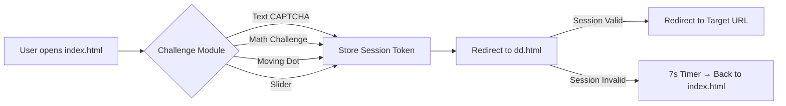

# Deep Dey – The Future IITian 🎓✨

[](https://www.deepdeyiitk.com)
[](https://www.youtube.com/@deepdeyiit)
[](mailto:thedeeparise@gmail.com)

---

## About Me

Hi! I’m **Deep Dey**, a passionate Class 11 CBSE student from Tripura and a determined JEE aspirant aiming for **JEE 2027**. My goal is to achieve **240+ in JEE Mains, 330+ in JEE Advanced, and secure AIR < 70**, ultimately joining **IIT Kanpur (CSE Branch)**.

I love blending **creativity with learning**, building interactive websites, making engaging content, and inspiring others through my journey.
I strongly believe in **discipline, focus, and the power of consistency**—every small effort today builds the foundation for tomorrow’s success.

* 🎯 **Mission:** Create a hub for JEE aspirants to access high-quality resources while sharing my personal preparation journey.
* 💻 **Skills:** HTML, CSS, JavaScript, Python, Odoo, Web Animations, UX/UI Design
* 🌐 **Website:** [www.deepdeyiitk.com](https://www.deepdeyiitk.com)
* 📹 **YouTube:** [Deep Dey Channel](https://www.youtube.com/@deepdeyiit)

---

## Features of My Projects

* **Interactive Websites:** Modern, responsive designs with smooth animations.
* **Educational Resources:** Free and premium JEE materials with secure downloads.
* **Visual Effects:** Confetti, glassmorphism, animated SVG blobs, and sparkles for engagement.
* **Donation & Support System:** Integrated with Razorpay for seamless contributions.
* **Custom Thank You Pages:** Personalized messages for donors and supporters.
* **Future Enhancements:** Mobile app integration, encrypted downloads, and more interactive features for aspirants.

---

## Tech Stack

* **Frontend:** HTML5, CSS3, JavaScript, SVG, Canvas Animations
* **Backend/Hosting:** Odoo, Razorpay Integration, GitHub Pages
* **Design Tools:** Figma, Glassmorphism, Gradient Effects, Animation Libraries

---

## How to Use

1. **Clone the Repo**

```bash
git clone https://github.com/deepdeyiitgn/deydeep.git
cd deepdey
```

2. **Open `index.html`** in your browser to explore my website.
3. Navigate through sections like **Home, Contact, Donate, and Resources**.

---

## How to Deploy

To deploy your website hosted on GitHub Pages, follow these steps:

---

### ✅ Step 1: Push Your Code to GitHub

1. **Clone your repository** (if you haven't already):

   ```bash
   git clone https://github.com/deepdeyiitgn/deydeep.git
   cd deepdey
   ```

2. **Add your files** (if not already added):

   ```bash
   git add .
   git commit -m "Initial commit"
   ```

3. **Push to GitHub**:

   ```bash
   git push origin main
   ```

---

### ✅ Step 2: Enable GitHub Pages

1. **Navigate to your repository**: [https://github.com/deepdeyiitgn/deydeep](https://github.com/deepdeyiitgn/deydeep)

2. **Go to Settings** (⚙️ icon).

3. **Scroll down to the "Pages" section**.

4. **Under "Source"**, select `main` branch and `/ (root)` folder.

5. **Click "Save"**.

6. **Make Sure "Add" the below code in all html files head or body area!**.

```
<script src="verify.js"></script>
<script>
  protectPage(); // agar user verified nahi hai, redirect index.html
</script>

// Har HTML file me isko include karo <head> ya <body> mei
// Include this in every HTML file in <head> or <body>
```

---

### ✅ Step 3: Access Your Live Website

After a few minutes, your site will be live at:

```
https://[username].github.io/deydeep/
```

---

### 🔧 Troubleshooting Tips

* **Ensure `index.html` is in the root directory** of your repository.
* **Check for typos** in file names and paths.
* **Clear your browser cache** or try accessing the site in an incognito window.

---

If you encounter any issues or need further assistance, feel free to ask!

---

## Achievements & Milestones

* Scored **93% in 10th Grade Maths** and **80.6% overall** in Madhyamik (TBSE).
* Cleared 10th board exams on **13th March 2025**, starting JEE preparation with focus and dedication.
* Consistently streaming daily **study sessions** to maintain accountability and discipline.
* Building a **community of learners** through my website and YouTube channel.

---

## Contribution

I welcome contributions to improve my projects or add new features.

* Fork the repo 🔀
* Make your changes ✨
* Submit a pull request 📩

---

## Contact Me

* **Email:** [contact@deepdeyiitk.com](mailto:thedeeparise@gmail.com)
* **Instagram:** [@deepdey.official](https://www.instagram.com/deepdey.official)
* **YouTube:** [Deep Dey](https://www.youtube.com/@deepdeyiit)
* **Website:** [www.deepdeyiitk.com](https://www.deepdeyiitk.com)

---

> “Your support isn’t just helping me—it’s inspiring a whole community of dreamers and doers.” 💜

---

Made with ❤️ and relentless focus by **Deep Dey**

---
---
---
---

<p align="center">
  
</p>

<h1 align="center">🌟 Human Verification System [INFORMATION] </h1>

<p align="center">
  <b>Modular, Client-Side Human Verification | AI & JS Powered | GitHub Pages Ready</b><br>
  
</p>

<p align="center">
  
</p>

---

## 📌 Table of Contents

* [Project Overview](#project-overview-🚀)
* [Features](#features-✨)
* [File Structure](#file-structure-📂)
* [Installation & Deployment](#installation--deployment-🛠️)
* [Usage](#usage-🚀)
* [dd.html Redirect Info](#ddhtml-redirect-info-🔗)
* [Workflow](#workflow-📈)
* [Technologies & Badges](#technologies--badges-💻)
* [Acknowledgements](#acknowledgements-🙏)
* [Contact & Socials](#contact--socials-🌐)

---

## Project Overview 🚀

A **modular, client-side human verification system** featuring multiple challenge modules (text, math, slider, moving dot), session management (6-hour token), and secure redirection. Fully static, professional, and deployable on GitHub Pages.

💡 Designed for **maximum user engagement** with modern UI, animations, and interactive challenges.

---

## Features ✨

* **Multiple Verification Modules:**

  * Text CAPTCHA 📝, Arithmetic ➕, Moving Dot 🎯, Slider ⬅️➡️
* **Session Management:**

  * LocalStorage-based token valid for **6 hours**
* **Secure Redirects:**

  * `dd.html` validates session → valid → redirect
  * Invalid → 7s countdown → back to verification page
* **Modern UI & Animations:**

  * Confetti 🎉, smooth transitions, interactive feedback
* **Static Deployment:**

  * GitHub Pages or any static host ready
* **Extensible:**

  * Easy to add new challenges or update redirect URL

 * **Live Demo:**
 * Want to check live demo: [support.deepdeyiitk.com](https://support.deepdeyiitk.com/)

---

## File Structure 📂

```
index.html          # Main entry page; challenge container
style.css           # Modern styling & animations
utils.js            # Session/token management & helper functions
main.js             # Challenge loader & verification workflow
text.js             # Canvas-based text CAPTCHA
math.js             # Arithmetic challenge
dot.js              # Moving dot challenge
slider.js           # Slider verification (desktop + mobile)
puzzle.js           # Human-friendly drag piece verification, bot-resistant system.
dd.html             # Redirect page; session detection + fallback
README.md           # Project documentation (this file)
SECURITY.md         # Guidelines: domain restriction, bot prevention, usage rules
LICENSE.md          # Modified MIT-style license with credit & domain rules
```

---

## Installation & Deployment 🛠️

1. Clone the repo:

```bash
git clone https://github.com/deepdeyiitgn/support-page-deepdeyiitk.com.git
```

2. Open `index.html` to test locally or deploy to **GitHub Pages**.

3. Optional: Customize challenges and redirect URL in `dd.html`.

---

## Usage 🚀

1. Open `index.html`.
2. Complete any challenge module.
3. Session stored in localStorage (6h).
4. Redirect via `dd.html`:

   * ✅ Session valid → go to target URL
   * ❌ Invalid → 7s countdown → back to verification

---

## dd.html Redirect Info 🔗

* **Redirect URL variable (top of `<script>`):**

```javascript
const REDIRECT_TARGET = "https://docs.google.com/forms/d/e/1FAIpQLSdqcVijtxP2qtiwFtuS-NFBL9_Pnbf6WwiydLnzh4nbxQWy1Q/viewform";
```

* **Session Detection Logic:**

```javascript
if (localStorage.getItem("verifiedToken")) {
    // ✅ valid → redirect
    window.location.href = REDIRECT_TARGET;
} else {
    // ❌ invalid → show error + 7s timer
    setTimeout(() => {
        window.location.href = "index.html";
    }, 7000);
}
```

---

## Workflow 📈



---

## Technologies & Badges 💻

**Frontend & UI:**


**Tools & Utilities:**


---

## Acknowledgements 🙏

* GitHub profile README designs inspiration
* JS & Canvas open-source practices
* AI-assisted modular project design

---

## Contact & Socials 🌐

<p align="center">
  <a href="https://www.deepdeyiitk.com"></a>
  <a href="mailto:thedeeparise@gmail.com"></a>
  <a href="https://www.instagram.com/deepdey.official/"></a>
  <a href="https://www.youtube.com/@deepdeyiit"></a>
  <a href="https://x.com/deepdeyofficial"></a>
</p>

---

<p align="center">
  <em>Designed & Developed with ❤️ by <b>Deep Dey</b> — Professional, Modular, AI-assisted Frontend Verification System</em>
</p>

<p align="center">
  
</p>

---

